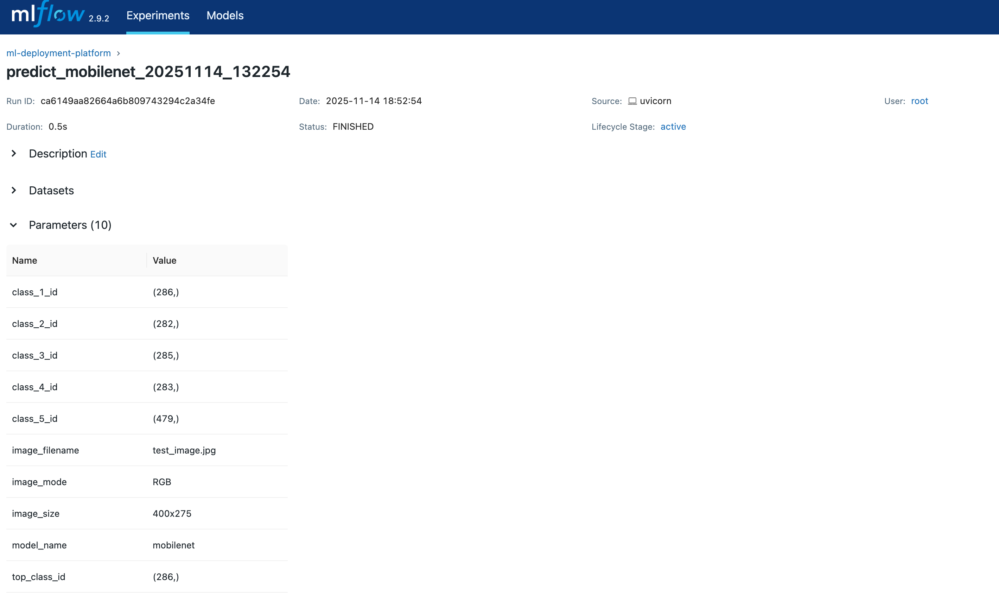
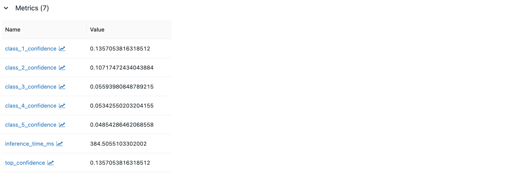

# ML Deployment Platform
- CI/CD Pipeline for ML Models with Monitoring 
- Helps in deploying ML models effortlessly.

## MLflow Integrated in Platform 🔬

This platform includes comprehensive experiment tracking using MLflow.

### Features

- **Automatic Experiment Tracking**: Every prediction is logged
- **Model Versioning**: Track model versions and metadata
- **Performance Metrics**: Inference time, confidence scores
- **Parameter Logging**: Model configs, image metadata

### Accessing MLflow UI
```bash
# Start the platform
docker-compose up

# Open MLflow UI
open http://localhost:5000
```

### What Gets Logged

**Model Loading:**
- Model name and type
- Model URL and version
- Input shape
- Loading timestamp

**Predictions:**
- Model used
- Image filename and dimensions
- Inference time (ms)
- Top 5 predictions with confidence scores
- Timestamp

### Example MLflow Queries
```bash
# Check MLflow health
curl http://localhost:8000/mlflow/health

# View experiments in UI
open http://localhost:5000

# Filter by model
# Use MLflow UI filters: model_name = "mobilenet"
```

### Model Registry

All models are versioned:
```json
{
  "name": "mobilenet",
  "version": "1.0.0",
  "framework": "tensorflow",
  "framework_version": "2.14.0"
}
```

### Screenshots




