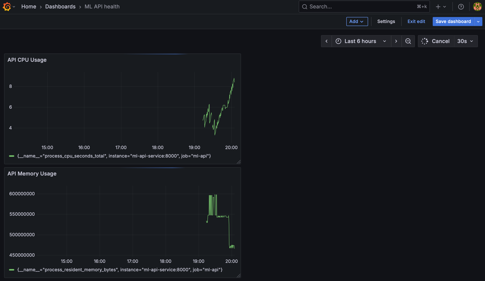

# ML Deployment Platform

**Production-ready Kubernetes deployment with cost optimization, monitoring, and AWS cloud integration**

[](.)
[](.)
[](.)


## Features
- **FastAPI** backend for model serving
- **MLflow** integration for experiment tracking and model versioning
<!-- - **Docker** multi-stage builds (86% size reduction)  -->
- **Kubernetes** deployment with service discovery
- Automated logging of predictions and metrics
- **Prometheus + Grafana** CPU Usage and API Health monitoring
- Production-ready K8s manifests. Can deploy to any managed service (EKS/GKE/AKS)

---

## 🚀 Cloud Deployment Experience
**AWS EKS/ECR Implementation**
- Pushed 2.36GB containerized ML platform to AWS Elastic Container Registry
- Deployed to Kubernetes (local + cloud-ready manifests for EKS/GKE/AKS)
- Debugged CloudFormation failures, implemented emergency cost controls
- **Cost optimization:** Identified and terminated orphaned resources within 30 minutes (prevented ₹100+/day overrun)

[Read full AWS deployment story →](#aws-deployment-details)

## MLflow Integrated 🔬

Comprehensive experiment tracking for all model predictions.

### What Gets Logged

**Model Loading:**
- Model name, type, and version
- Model URL and input shape
- Loading timestamp

**Predictions:**
- Model used
- Image filename and dimensions
- Inference time (ms)
- Top 5 predictions with confidence scores
- Timestamp

### Accessing MLflow UI

**Docker Compose:**
```bash
docker-compose up
open http://localhost:5000
```

**Kubernetes:**
```bash
kubectl port-forward svc/mlflow-service 5000:5000
open http://localhost:5000
```

### Model Registry
```json
{
  "name": "mobilenet",
  "version": "1.0.0",
  "framework": "tensorflow",
  "framework_version": "2.14.0"
}
```

### Screenshots


---

## Kubernetes Deployment

### Architecture
- **2 FastAPI pods** - Load balanced via Service
- **1 MLflow pod** - Experiment tracking backend
- **Services:** 
  - `ml-api-service` (NodePort) - External access
  - `mlflow-service` (ClusterIP) - Internal communication
- **Service Discovery** - Pods communicate via K8s DNS

### Deploy to Minikube
```bash
# Start Minikube
minikube start

# Use Minikube's Docker daemon
eval $(minikube docker-env)

# Build image
docker build -t ml-deployment-platform-api:latest .

# Deploy all components
kubectl apply -f k8s/

# Get access URL
minikube service ml-api-service --url

# Test API
curl http://<url-from-above>/

# Test prediction
curl -X POST http://<url>/predict/mobilenet -F "file=@test_image.jpg"
```

### Verify Deployment
```bash
# Check pods
kubectl get pods

# Check services
kubectl get svc

# View logs
kubectl logs -l app=ml-api

# Access MLflow
kubectl port-forward svc/mlflow-service 5000:5000
```
---

## Monitoring - Prometheus + Grafana

### Architecture
- Deployed Prometheus and Grafana pods to K8
- Exposed metrics (memory, CPU, request metrics) from FastAPI
- Scraped metrics using Prometheus
- Visualized Metrics with Grafana

### Access Grafana Dashboard
**Start Grafana:**
```bash
# Get Grafana URL
minikube service grafana-service --url

# Open in browser (example URL)
open http://127.0.0.1:30002
```

**Login credentials:**
- Username: `admin`
- Password: `admin`

**View dashboards:**
1. Click "Dashboards" in left sidebar
2. Select "ML API Health" (or your dashboard name)
3. Real-time metrics update every 15 seconds



### Access Prometheus
```bash
# Get Prometheus URL
minikube service prometheus-service --url

# Open in browser
open http://127.0.0.1:30001
```

---

### Future Enhancements
- [ ] Persistent Volumes for MLflow data
- [ ] Liveness/Readiness probes for self-healing
- [ ] Resource requests/limits
- [ ] Horizontal Pod Autoscaling
- [ ] Ingress controller for production routing

---

## AWS Deployment Details

### Objective
Deploy containerized ML platform to AWS Elastic Kubernetes Service (EKS) in Mumbai region.

### Implementation Steps
1. **ECR Setup:** Pushed 2.36GB Docker image to Elastic Container Registry
```bash
   aws ecr create-repository --repository-name ml-platform-api --region ap-south-1
   aws ecr get-login-password | docker login ...
   docker push ACCOUNT_ID.dkr.ecr.ap-south-1.amazonaws.com/ml-platform-api:latest
```

2. **EKS Cluster Creation:** Used `eksctl` for managed Kubernetes
```bash
   eksctl create cluster --name ml-platform --region ap-south-1 \
     --nodegroup-name workers --node-type t3.small --nodes 2
```

3. **Incident Response:** Node capacity failure left 6 EC2 instances stopped with 48GB EBS volumes
   - Diagnosed via CloudFormation stack events
   - Force-deleted stuck resources using AWS CLI
   - Prevented cost overrun (was tracking toward ₹100+/day)

### Key Learnings
- ✅ Production Kubernetes deployment workflow (local → ECR → EKS)
- ✅ AWS IAM permissions and CloudFormation debugging
- ✅ Real-time cost monitoring and resource cleanup
- ✅ Incident response under time pressure

### Tools Used
`AWS CLI` · `eksctl` · `kubectl` · `CloudFormation` · `ECR` · `EKS` · `EC2` · `EBS`

### Interview Story
> "I attempted EKS deployment and hit a node capacity failure. Six instances got stuck in 'stopped' state with 48GB of attached EBS volumes - my AWS Free Tier usage spiked to 145%. I debugged CloudFormation events, force-deleted stacks, and manually terminated all resources in under 30 minutes. Total cost: ₹17. This taught me to always verify region capacity and set billing alarms before provisioning production infrastructure."

**Status:** Production-ready K8s manifests. Can deploy to any managed service (EKS/GKE/AKS) in <15 minutes.

## Local Development (Docker Compose)
```bash
docker-compose up
open http://localhost:8000/docs
```


## Setup Instructions

### Email Alerts Configuration

The AlertManager email credentials are stored in a Kubernetes Secret (not in Git). You will have to setup the secret in cluster before running.

**To set up on a new cluster:**
```bash
kubectl create secret generic alertmanager-smtp \
  --from-literal=smtp_from='your-email@gmail.com' \
  --from-literal=smtp_auth_username='your-email@gmail.com' \
  --from-literal=smtp_auth_password='your-gmail-app-password' \
  --from-literal=email_to='alert-recipient@example.com'
```

Get Gmail App Password: https://myaccount.google.com/apppasswords